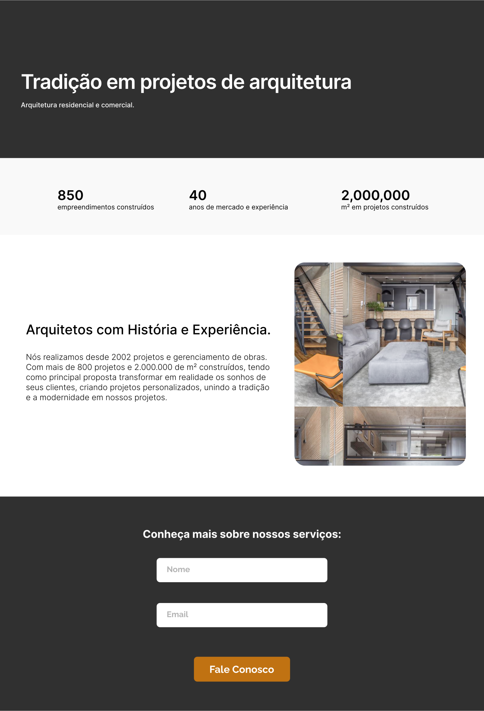

<h1 align="center">

Desafio Landing Page

</h1>

### desafio-landing-page
Este é um desafio de projeto de desenvolvimento do módulo base do curso de tecnologia da Escola DNC.

### Tecnologias Utilizadas ❤️
HTML5 | CSS3 | SHEET MONKEY

### Links 📌
> Link do site disponibilizado: [DNC ARQUITETURA]()

> Link da planilha de registro de informação: [Google Sheets](https://docs.google.com/spreadsheets/d/15_Ov9_XMfoQk21dt4Yl7H11OPQdf3X6Hc49IbUUu9fs/edit?usp=sharing)

### Layout do site 🖥️
